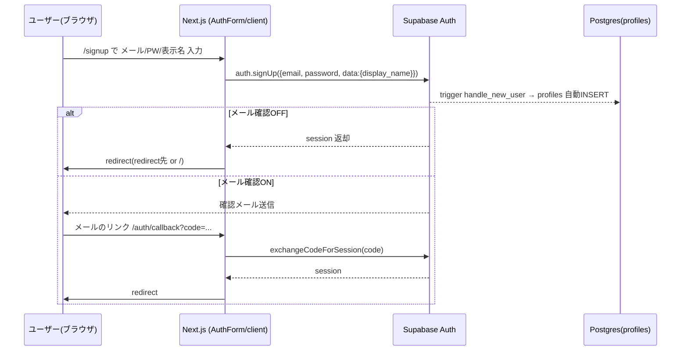
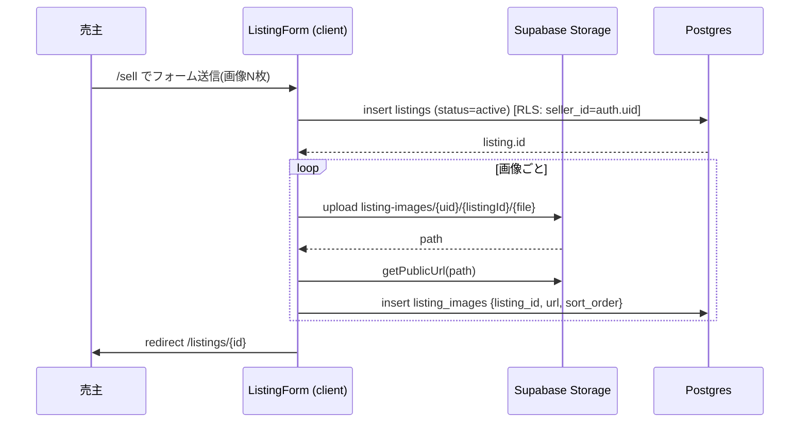
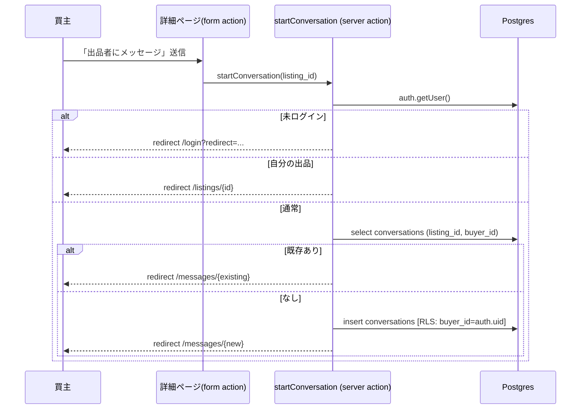
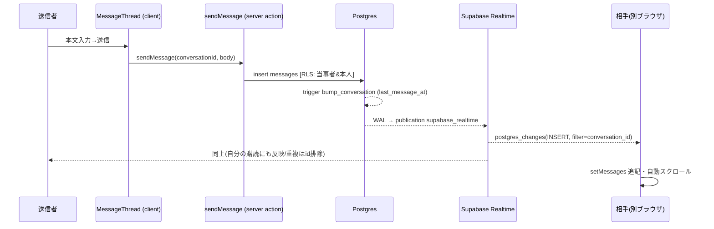
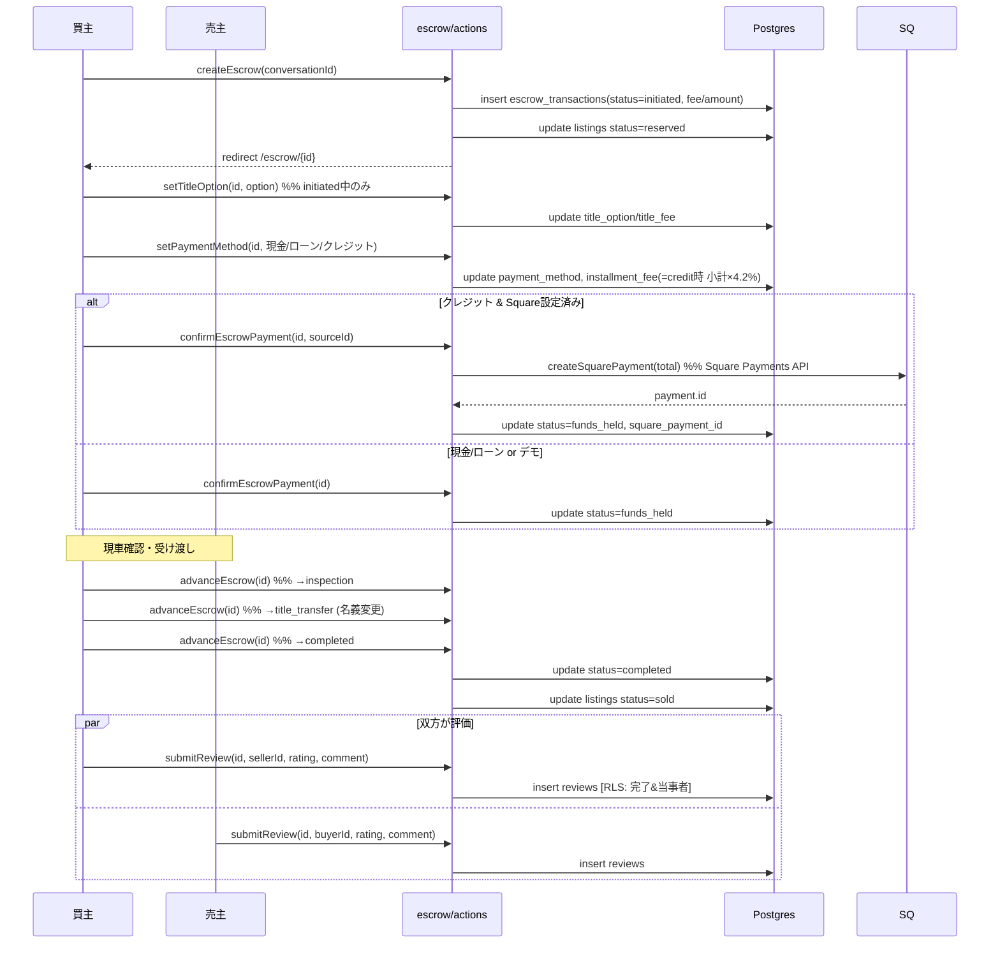
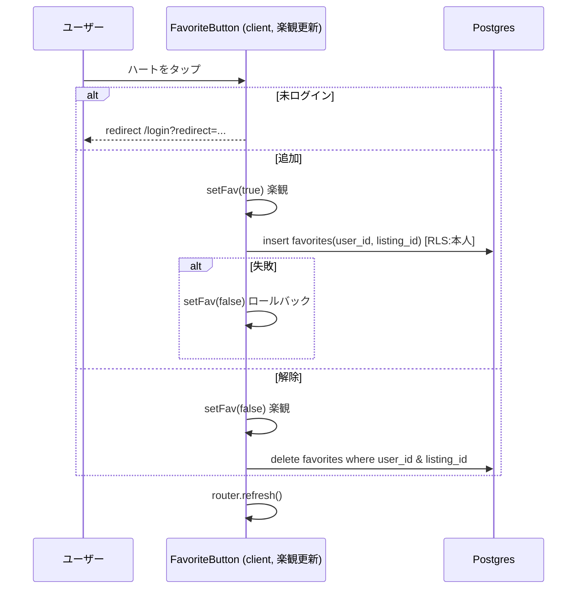
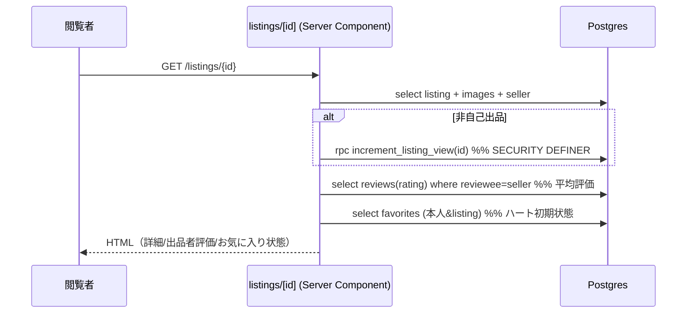

# シーケンス図 — BUYMO C2C

実装（Server Actions / Supabase / RLS）に基づく主要フローのシーケンス図。
GitHub 上では Mermaid が描画されます。

---

## 1. 会員登録・ログイン

---

## 2. 出品（画像アップロード込み）

---

## 3. 問い合わせ（会話開始）

---

## 4. メッセージ送信（Realtime）

---

## 5. エスクロー取引（作成→完了→評価）

> 進行権限: `initiated→funds_held`=買主 / `funds_held→inspection`=両者 /
> `inspection→title_transfer`=両者 / `title_transfer→completed`=買主。
> `initiated|funds_held` ではキャンセル可（cancelEscrow → listing=active へ復帰）。

---

## 6. お気に入りトグル

---

## 7. 出品詳細表示と閲覧数

